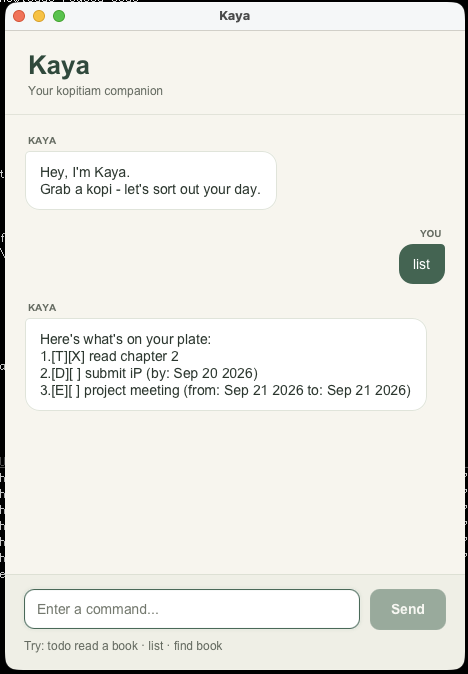

# Kaya User Guide

Kaya is your kopitiam companion for keeping track of tasks. Grab a kopi,
add what's on your plate, and work through it one thing at a time.



## Getting started

1. Install **Java 25**. Run `java -version` in your terminal to check the version.
1. Put `kaya.jar` in a folder where you want to keep your tasks. If you do not
   have the JAR yet, follow the
   [project's build instructions](https://github.com/tkythomas/ip#building-and-running-the-executable-jar).
1. Open a terminal in that folder and run:

   ```bash
   java -jar kaya.jar
   ```

1. In the Kaya window, type a command at the bottom and press **Enter** or click
   **Send**. Scroll to read earlier replies; resize the window for more room.

Always launch Kaya from the same folder to use the same saved task list.

## Try your first tasks

Enter these commands **one at a time**. The example assumes an empty task list.

```text
todo read chapter 2
deadline submit iP /by 2026-09-20
event project meeting /from 2026-09-21 /to 2026-09-21
mark 1
list
```

Kaya's list reply will be:

```text
Here's what's on your plate:
1.[T][X] read chapter 2
2.[D][ ] submit iP (by: Sep 20 2026)
3.[E][ ] project meeting (from: Sep 21 2026 to: Sep 21 2026)
```

`[T]` means todo, `[D]` means deadline, and `[E]` means event.
`[X]` means done; `[ ]` means not done. Marked tasks stay in your list.

## Commands at a glance

Replace uppercase words such as `DESCRIPTION` and `NUMBER` with your own values.
Command words and field names are **case-sensitive**: use `todo`, not `TODO`.
Descriptions can contain spaces and Unicode text. Duplicate descriptions are allowed.

| Action | Format | Example |
| --- | --- | --- |
| Add a task without a date | `todo DESCRIPTION` | `todo buy kopi` |
| Add a task with a due date | `deadline DESCRIPTION /by DATE` | `deadline return book /by 2026-09-20` |
| Add an event with start and end dates | `event DESCRIPTION /from DATE /to DATE` | `event study session /from 2026-09-21 /to 2026-09-21` |
| Show every task, including completed ones | `list` | `list` |
| Find tasks by description | `find TEXT` | `find book` |
| Mark a task as done | `mark NUMBER` | `mark 1` |
| Mark a task as not done | `unmark NUMBER` | `unmark 1` |
| Edit one detail of a task | `update NUMBER FIELD VALUE` | `update 1 /description read chapter 3` |
| Remove a task | `delete NUMBER` | `delete 1` |
| Close Kaya after its farewell | `bye` | `bye` |

`list` and `bye` do not take extra arguments. `delete` removes the selected task;
there is no undo command, so check its number first.

### Dates and spacing

Use real calendar dates in **`yyyy-MM-dd`** format, such as `2026-09-20`.
Kaya accepts dates only, without a time of day. Events may start and end on the
same date; their end cannot be before their start.

Leading and trailing spaces are ignored. Extra spaces or tabs can separate
command words, fields, and dates; spacing inside descriptions is preserved.
Use `/by` exactly once for a deadline, or `/from` then `/to` exactly once each
for an event. These standalone date-field tokens are reserved in deadline and
event commands, so avoid using them as words in those descriptions.

### Task numbers and searching

Task numbers start at **1**. Before marking, unmarking, updating, or deleting,
use `list` to get the task's current number. Deleting a task shifts the numbers
of later tasks.

`find` matches text anywhere in a description, ignoring letter case:
`find BOOK` can match both "return book" and "read textbook". A phrase such as
`find project meeting` is searched as one continuous phrase. Dates and completion
status are not searched.

**Search results are numbered separately.** A number shown by `find` may refer
to a different task in `list`; always use the number from `list` when changing a task.

### Updating a task

An update changes **one field at a time**. Use the field appropriate to the
task's type:

| Field | Works with | Example |
| --- | --- | --- |
| `/description` | Any task | `update 1 /description read chapter 3` |
| `/by` | Deadline | `update 2 /by 2026-09-22` |
| `/from` | Event | `update 3 /from 2026-09-20` |
| `/to` | Event | `update 3 /to 2026-09-23` |

The examples refer to the three tasks in "Try your first tasks". Updates keep
the task's position, type, completion status, and other details. For example,
updating the first task's description gives:

```text
All sorted. I've updated this task:
  [T][X] read chapter 3
```

An event must remain valid after each update. To move its start beyond its
current end, extend the end first. Everything after `/description` is literal
description text, including strings such as `/by`; it does not update a second field.

## Saving your tasks

Kaya saves automatically after a successful addition, mark, unmark, update, or
deletion. No separate save command is needed. Tasks are stored in
`data/kaya.txt`, relative to the folder from which you launch Kaya.

A missing data file is normal on the first run: Kaya starts with an empty list
and creates the file when saving your first task. To move or back up your tasks,
close Kaya and copy the entire `data` folder with your JAR.

## If something goes wrong

| Problem | What to do |
| --- | --- |
| Unknown command or missing details | Check the command table and Kaya's reply. For example, `todo` needs a description and `find` needs search text. |
| Invalid date or date fields | Use `yyyy-MM-dd`, check the calendar date, and supply each required field once in the correct order. |
| Invalid task number | Run `list` and use an existing whole number starting from 1. |
| Field does not match the task | Use `/by` only for deadlines and `/from` or `/to` only for events. |
| "I couldn't save your tasks" | The command was rolled back. Check that the launch folder is writable and the data file is not read-only. The data path must be a regular file, not a directory or symbolic link. If the location cannot safely replace files, use a local folder. |
| Warning about unreadable saved tasks at startup | Changes are disabled to protect the original file. You can still list or search any records that loaded. Close Kaya, back up the file, repair its contents or permissions (or restore a known good copy), then restart. |

Invalid commands leave your tasks unchanged. If an expected task list appears
empty, check that you launched Kaya from the folder containing its `data` folder.

## Further information

- [Testing guide](Testing.md): automated checks and manual GUI checks.
- [Project and acknowledgements](https://github.com/tkythomas/ip#acknowledgements):
  source code and credits for the se-edu starter and JavaFX tutorial.
